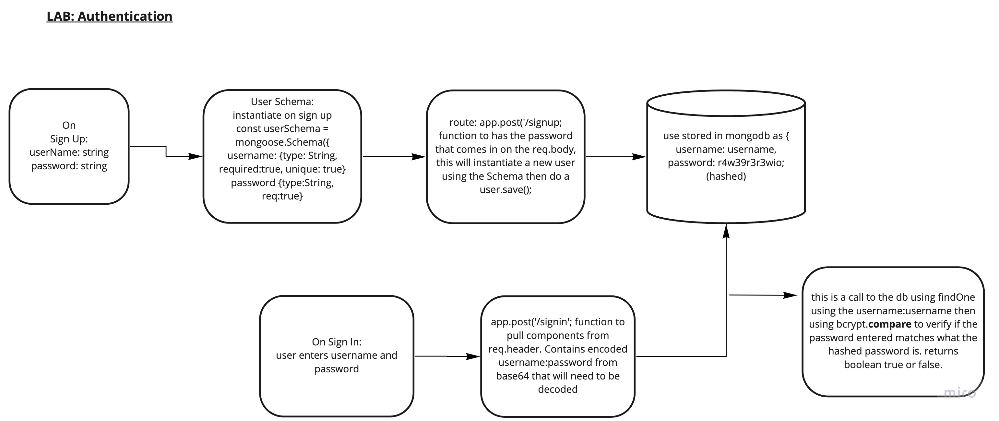

# Lab: Class 06

## Project: basic-auth

### Author: Audrey Patterson

## Links and Resources

- [Main Branch deployed to heroku](https://audrey-basic-auth.herokuapp.com/)
- [ci/cd](https://github.com/arpatterson31/basic-auth/actions)
- [Pull Request dev to main](https://github.com/arpatterson31/basic-auth/pull/1)

- [Mongoose pre-save hook](https://mongoosejs.com/docs/middleware.html#pre)
- [Mongoose Methods on schemas](https://mongoosejs.com/docs/guide.html#methods)
- TA Joe Pennock helped with the method on the schema using the .stricts

### Setup

#### `.env` requirements (when applicable)

i.e.

- `PORT` - 3333

#### How to initialize/run your application (where applicable)

- e.g. `npm start`

#### Tests

- How do you run tests?
  - run `npm test` in the terminal from root
- Any tests of note?
  - POST to /signup to create a new user
  - POST to /signin to login as a user (use basic auth)
  - Need tests for auth middleware and the routes
    - Does the middleware function(send it as a basic header)
    - Do the routes assert the requirements (signup/signin)
- Describe any tests that you did not complete, skipped, etc

#### UML / Application Wiring Diagram

